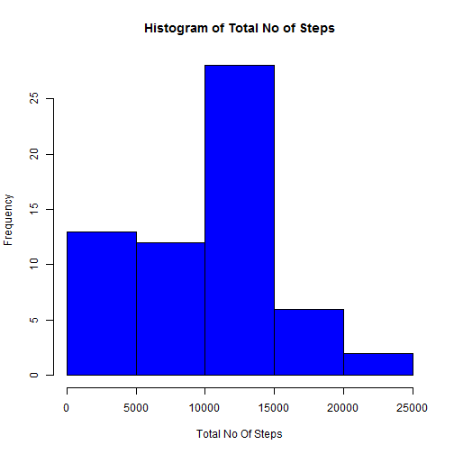
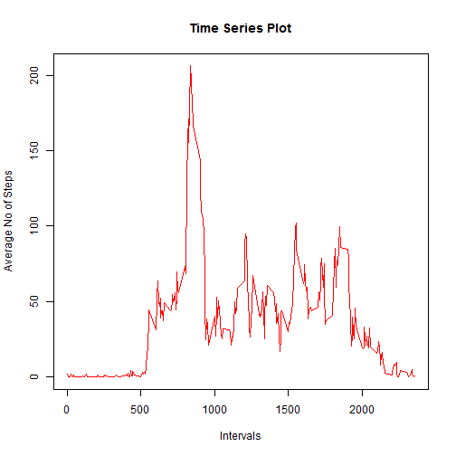
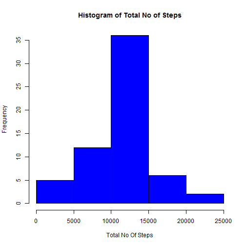
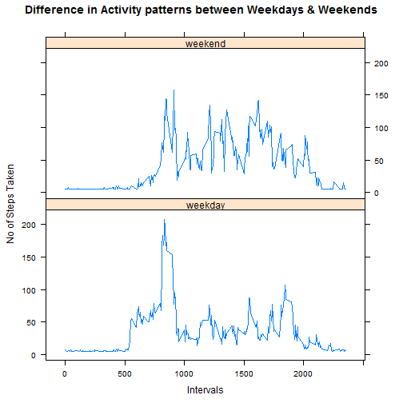

Reproducible Research Peer Assessment 1
=========================================

##1. Loading and preprocessing the data

The data for the assessment is loaded into R using the read.csv() function


```r
data <- read.csv("activity.csv",header=TRUE)
str(data)
```

```
## 'data.frame':	17568 obs. of  3 variables:
##  $ steps   : int  NA NA NA NA NA NA NA NA NA NA ...
##  $ date    : Factor w/ 61 levels "2012-10-01","2012-10-02",..: 1 1 1 1 1 1 1 1 1 1 ...
##  $ interval: int  0 5 10 15 20 25 30 35 40 45 ...
```

```r
summary(data)
```

```
##      steps                date          interval     
##  Min.   :  0.00   2012-10-01:  288   Min.   :   0.0  
##  1st Qu.:  0.00   2012-10-02:  288   1st Qu.: 588.8  
##  Median :  0.00   2012-10-03:  288   Median :1177.5  
##  Mean   : 37.38   2012-10-04:  288   Mean   :1177.5  
##  3rd Qu.: 12.00   2012-10-05:  288   3rd Qu.:1766.2  
##  Max.   :806.00   2012-10-06:  288   Max.   :2355.0  
##  NA's   :2304     (Other)   :15840
```


##2. Mean total number of steps taken per day

* Calculate Total Steps excluding the NA Values in the data set 

```r
total_steps_per_day <- aggregate(data$steps,by = list(data$date),sum,na.rm=TRUE)
names(total_steps_per_day) = c("Date","Total")
head(total_steps_per_day)
```

```
##         Date Total
## 1 2012-10-01     0
## 2 2012-10-02   126
## 3 2012-10-03 11352
## 4 2012-10-04 12116
## 5 2012-10-05 13294
## 6 2012-10-06 15420
```

* Display the histogram and compute Mean and Median 

```r
hist(total_steps_per_day$Total, col= "blue",xlab = "Total No Of Steps",main = "Histogram of Total No of Steps")
```

 

```r
#Calculate Mean and Median
mean <- mean(total_steps_per_day$Total)
median <- median(total_steps_per_day$Total)
```

Mean :  9354.23 

Median :  10395 


##3. Average daily activity pattern

* Compute Average no of steps per interval

```r
average<- aggregate(data$steps, by = list(data$interval),mean,na.rm=TRUE)
names(average) = c("Intervals","AverageSteps")
head(average)
```

```
##   Intervals AverageSteps
## 1         0    1.7169811
## 2         5    0.3396226
## 3        10    0.1320755
## 4        15    0.1509434
## 5        20    0.0754717
## 6        25    2.0943396
```

* Time Series Plot of 5-minute interval (x-axis) and the average number of steps taken, averaged across all days

```r
plot(x = average$Intervals, y=average$AverageSteps, type="l",col="red",ylab="Average No of Steps",
     xlab="Intervals", main="Time Series Plot")
```

 

```r
maximum<-average[which.max(average$AverageSteps),1]
```

5 Minute interval that has maximum number of steps : 835


##4. Imputing missing values

* Get the total no of NA Values

```r
count_of_na <- sum(is.na(data$steps))
na_positions <- which(is.na(data$steps))
```
The no of NAs : 2304  

* Strategy for filling the NA Values. Here mean no of steps is used.

```r
vector_of_means <- rep(mean(data$steps, na.rm=TRUE), length(na_positions))
data[na_positions, "steps"] <- vector_of_means
head(data)
```

```
##     steps       date interval
## 1 37.3826 2012-10-01        0
## 2 37.3826 2012-10-01        5
## 3 37.3826 2012-10-01       10
## 4 37.3826 2012-10-01       15
## 5 37.3826 2012-10-01       20
## 6 37.3826 2012-10-01       25
```

* Computing total_steps with the NAs populated.

```r
total_steps <- aggregate(data$steps,by = list(data$date),sum,na.rm=TRUE)
names(total_steps) = c("Date","Total")
head(total_steps)
```

```
##         Date    Total
## 1 2012-10-01 10766.19
## 2 2012-10-02   126.00
## 3 2012-10-03 11352.00
## 4 2012-10-04 12116.00
## 5 2012-10-05 13294.00
## 6 2012-10-06 15420.00
```

```r
hist(total_steps$Total, col= "blue",xlab = "Total No Of Steps",main = "Histogram of Total No of Steps")
```

 

* Computing Mean and Median

```r
new_mean <- mean(total_steps$Total)
new_median <- median(total_steps$Total)
```

Mean : 1.0766189 &times; 10<sup>4</sup>

Median : 1.0766189 &times; 10<sup>4</sup>


##5. Differences in activity patterns between weekdays and weekends

* Getting Days of Week and populating the appropriate value

```r
data$day_of_week<- ifelse(weekdays(as.Date(data$date)) %in% c("Saturday", "Sunday"),'weekend','weekday')                                                
```

* Computing average number of steps taken, averaged across all weekday days or weekend days

```r
average<- aggregate(data$steps, by=list(data$interval,data$day_of_week),mean)
names(average)=c("Interval","Day","Mean")
xyplot(average$Mean~average$Interval|average$Day,type='l',layout=c(1,2),
       xlab="Intervals",ylab="No of Steps Taken",
       main ="Difference in Activity patterns between Weekdays & Weekends")
```

 
